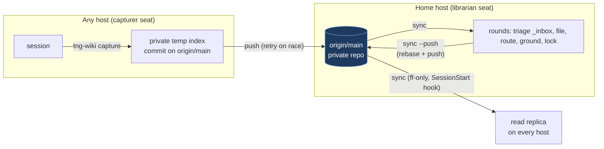

# Cross-machine wiki flow: capture to origin, one home librarian

Status: accepted 2026-09-27 (see [ADR 0001](../adr/0001-capture-to-origin-and-home-librarian.md)).
Evidence: the friction audit filed as
`mattezell-wiki/projects/_inbox/2026-09-27-tng-wiki-cross-machine-friction-audit.md`
(about 220 transcripts across three hosts, June to September 2026).

## Problem

The maintainer runs one wiki monorepo (four hubs) cloned on three machines, with many
concurrent agent sessions per machine. The `_inbox/` contract says capture is cheap and
filing is careful, but in practice a capturing session had to:

1. pick the right hub (sometimes two),
2. write the file in the right shape,
3. commit without sweeping up another session's staged work,
4. decide whether it may push (the global rule said no, so nothing got pushed),
5. and sometimes run `ground` because a second instruction said to.

Every one of those is a librarian-grade judgment made by a session that cannot make it
safely. The transport made it worse: at audit time one clone was 46 commits ahead of
origin, another 2 ahead and 53 behind, and an earlier reconcile (5 ahead / 84 behind)
needed a bundle backup, a scratch clone and a hand-written union-merge script.

## Principles

- **Capturing never fails and needs no judgment.** One command, one hub hint, done.
- **Judgment lives in one place.** Each hub has a home host whose librarian files,
  routes across hubs, grounds and locks. Nobody else writes compiled state.
- **Transport is automatic.** Captures land on the remote immediately; the librarian
  publishes at the end of rounds; every session starts from a fresh fast-forward.



## Design

### 1. `tng-wiki capture`

```
tng-wiki capture --wiki <hub> [--file <path> | stdin] [--title <t>] [--name <file.md>]
                 [--also <hub,hub>] [--trailer <line>] [--local] [--json]
```

- Resolves the hub (an explicit target is required, like every write verb, #47) and
  requires it to have an `_inbox/`.
- Content from `--file` or stdin. Frontmatter is completed, never overwritten: `title`
  (from `--title`, existing frontmatter, or the first `# ` heading), `date`,
  `captured_on` (this host), `also` (from `--also`, the other hubs the librarian should
  consider).
- Filename: `--name`, else `YYYY-MM-DD-<slugified title>.md`. A collision with a path
  already on origin or in the working tree gets a `-2`, `-3` suffix; the final path is
  reported. Capture must not fail over a name.
- **Transport, when the repo has an upstream:** fetch the upstream branch, build a
  commit on top of it using a private `GIT_INDEX_FILE` (read-tree, hash-object,
  update-index, write-tree, commit-tree), push that SHA to the upstream branch, and on a
  non-fast-forward rejection re-fetch and rebuild (bounded retries). The user's index and
  working tree are never touched during this, so concurrent sessions cannot collide
  with it. The capture is a new unique path, so it can never conflict.
- **Afterwards,** if the local branch can fast-forward to the new commit it does (this
  was verified to carry unrelated staged and dirty changes along untouched). If the local
  branch has unpushed commits, the capture appears locally on the next `sync --push`.
  The file is never pre-written into the working tree: an untracked file at the incoming
  path aborts a later fast-forward.
- **No upstream** (a local-only wiki repo): write the file, `git add` it, and
  `git commit --only -- <path>` so other staged work stays staged. No git at all: write
  the file.
- **Offline:** the capture is queued in `~/.tng-wiki/outbox/` and flushed by the next
  `capture` or `sync`. `doctor` reports a non-empty outbox.

### 2. Home librarian per hub

- `.tng-wiki.json` gains `"librarian": "<hostname>"`, committed, so every clone knows
  who files. Set and shown with `tng-wiki librarian [--set <host> | --clear] --wiki <hub>`.
- Host comparison is case-insensitive (`os.hostname()` returns `Legion-Ubuntu`,
  `LEGION5090`) and `TNG_WIKI_HOST` overrides the local name. The same fix applies to
  the existing `sharing: host:<name>` comparison.
- On any other host, verbs that write compiled state refuse with a message pointing
  at `capture`: `ground --update-lock / --fix-moved / --fix-index / --fix-dates`,
  `graduate`, `dismiss`, `log`, `upgrade`. `--off-host` overrides, for when the home host
  is down. Unset `librarian` means no change in behavior.
- `doctor`, `rounds` and `list` show the seat: librarian here, or capturer with the home
  host named.

### 3. `tng-wiki sync --push` and freshness

- `sync` stays fast-forward only, and now also reports local commits that were never
  pushed (the signal that was invisible at audit time), and flushes the outbox.
- `sync --push` (the librarian's publish step, the last step of rounds): per repo, fetch;
  ahead only, push; diverged, rebase the local commits onto the upstream (safe by
  construction, because with one librarian the only incoming changes are new capture
  files) and push. Tracked changes that are not committed refuse the rebase with a
  clear message (never auto-stash). A conflicting rebase is aborted and reported with
  the merge doctrine pointer.
- `sync --quiet` prints only arrivals and problems, for a SessionStart hook
  (`timeout 20 tng-wiki sync --quiet`), which keeps every read replica fresh without
  anyone asking. This moves data only; rounds stay manual.

### 4. Routing moves to the librarian

- A capturer picks one best-fit hub and lists the others in `also:`. It never writes
  the same finding twice.
- The home librarian sees all hubs and does the fan-out: host-adapted copies,
  `[[hub:page]]` cross-links, and moving a capture to a better hub.
- `tng-wiki inbox` lists pending captures across every registered wiki with age and
  `also:` hints (replacing the hand-rolled per-hub loops).
- Each hub's `## Scope` section is the routing table; `capture` without `--wiki` prints
  the scopes of the registered hubs instead of guessing.

### 5. Bootstrap: `tng-wiki join`

```
tng-wiki join <git-url> [--path <dir>] [--yes]
```

Clone (or adopt an existing clone of the same remote), register the hubs meant for
this host (the existing monorepo register with its sharing stamps), report the
code authorities that still need `localize`, install the skill, and print `doctor`.
`doctor` also checks that `tng-wiki` resolves in a non-interactive shell and prints the
exact fix when it does not (the recurring `command not found`).

### 6. Smaller fixes shipped alongside

- `cite show` resolves page names like `read` does (it had its own strict resolver).
- `upgrade --all` walks every registered wiki this host is librarian for.
- `cite show` suggests a new `#L` range for a code cite whose content moved and changed,
  by matching the lines at the locked authority SHA against the current file (suggest
  only; `--fix-moved` remains the only automatic rewrite).

## Alternatives considered

| Option | Why not (as the core) |
|---|---|
| GitHub Issues as the inbox | Takes captures out of git and out of `search`; needs `gh` auth on every seat; ties a generic tool to GitHub; unusable for wikis whose remote is not GitHub. Could later be an extra source that `sync` pulls into `_inbox/` (phone capture). |
| A PR per capture or per rounds pass | Review gates for a solo maintainer add babysitting, which is the problem being solved. |
| Central tailnet service (HTTP inbox and read API on the home host) | A new always-on service and a single point of failure; laptops lose access offline; git already provides the transport. Stays the documented option for teams. |
| One repo per hub | More repos to keep in sync; does not change who writes what. |
| Status quo plus instruction fixes and a push carve-out | Cheapest, but same-index collisions and multi-writer merge conflicts remain. |

## Consequences

- Pushing to the wiki repo becomes routine and pre-authorized; the repo must be private
  (it is), and the carve-out in the global instructions names wiki repos only.
- Off-home librarian work needs `--off-host`, which is deliberate friction.
- The first rebase after adoption is the last expected large one; afterwards local
  divergence on the home host only ever means "librarian commits not yet published".
